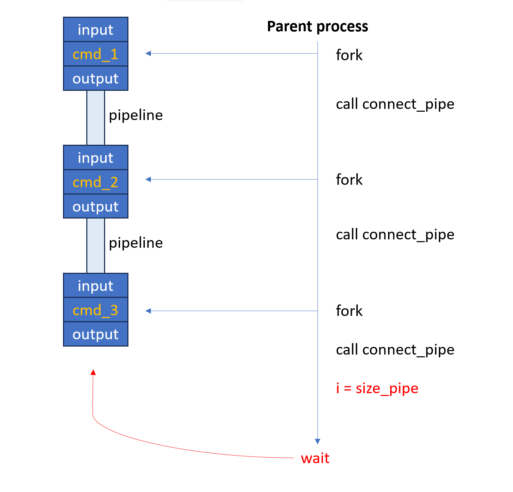
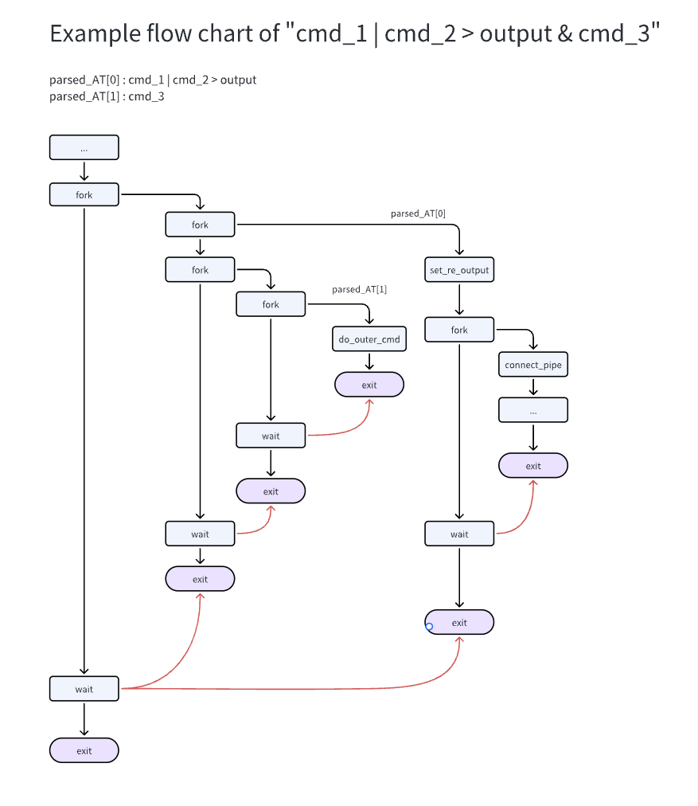

# Report:
## Functionality of the shell
## Structure of code
I implemented the whole shell using one single file `anubis.c`.

### Global variables
`int _BATCH` controls whether the shell will run in a batch mode, 1 for true.

`char **batch_buffer` saves commands from the input file when running in a batch mode and `int batch_buffer_size` its size. Creating as a global variable makes it easier to free the memory when exit the shell.

`char **path` saves an array of string of paths. `int path_size` saves the number of the paths for use of freeing memory when exiting.

### Functions

`do_one_line_cmd(char *line)` reads in one line command. In batch mode, it means the content of one line; in interactive mode, it means the content we typed before we type the enter. In this function, other functions will be called to implement complex commands. `fork()` functions will be called in this function, and in each child process, `void do_outer_cmd(int argc, char *argv[])`, `void connect_pipe(char **parsed_PIPE, int i, int size_pipe, int rc)` and `int set_re_output(char *cmd)` will be callded accordingly.

`char **parse(char *line, int *n, char *delim)` divides the codes by the delimiters.

`char *remove_consecutive_space(char *text)` deletes the extra unnecessary spaces and tabs to make sure the commands can be parsed into smallest units without any space or tab.

`int is_built_in_cmd(int argc, char *argv[])` returns whether the command is a built-in command, 1 for true.

`int do_built_in_cmd(int argc, char **argv, char *line)` will do one built-in command. `char *line` will be freed before exitting the anubis shell.

`int set_re_output(char *op)` reads in the redirective output command and will set the standard output and standard error to the file provided. If it succeeds, the file descriptor will be returned, or it will return -1.

`void do_outer_cmd(int argv, char *argv[])` uses `execv` to do an outer command. Before processing to a new command, `access` will be called to check whether the user is able run the command in the specific path by adding each path specified from the global variable `path` before the command. If not, it will return directly.

`void connect_pipe(char **parsed_PIPE, int i ,int size_pipe, int rc)` is a recursive function to connect the pipelines.  Details will be covered in the next part.

## Implementation of the shell

### General procedure
The shell reads in one line command in main function, and call `do_one_line_cmd` function.

In this function, first check whether the command is a built-in command, if so call `do_built_in_cmd`, after which the flow will return back to the while loop; 

Else fork the process, parse the command by `&` into `parsed_AT` and start iterate. 

In parent process, it will wait for all the child processes. This quarantees that the shell will wait for all the tasks done from the same line before going to the next line of batch mode or read in the next line in interactive mode.

### Built-in commands
In `do_built_in_cmd`, commands will be processes accordingly and errors will be returned when the command does not meet the requirement. `cd` command will call `chdir()` to change the working directories. `path` command will free the previous path stored in global variable `path[]` and allocate new memories to store the new input paths.

### Parallel commands
After the command is split by `&` into `char **parsed_AT` to run them in parallel. `fork()` will be callded in one for loop to iterate all the elements in the string array. New child processes will continue to the content of the next paragraph and the parent process will go on the iteration without waiting for the child processes. After the completion of the for loop, this main parent process will call another for loop to wait for all the child processes by calling `waitpid` with the pids of all child processes saved in the array. After waiting for exit of all child processes, this main parent process exits, and returns to *his* parent process.

In each iteration of `parsed_AT`, after redirect the output, the command will be checked whether it contains `|`. If yes, call `connect_pipe` else call `do_outer_cmd`.

### Redirect output
For each element in `parsed_AT`, if it contains `>`, it will be split by `>` to set redirective output. After that, the element will be divided by `|` to run the commands using pipelines by calling function `connect_pipe`. If there is no `|` in the element, it will call `do_outer_cmd` and run the single command alone.

### Pipes

Child processes will be created in this function. In child process, the write end of the pipeline is connected to the standard output (excpet the last one). In parent process, the read end of pipeline is connected to the standard input; the parent process carries the pipeline to the next child process by recursively calling this function and add `i` by 1. When `i` equals `size_pipe`, which means the function reaches the last command, the recursion ends and the process wait for all the processes to finish.

In each child process, `do_outer_cmd` will be called to do the specific command. 

An example of how the command `cmd_1 | cmd_2 | cmd_3` is executed in `connect_pipe` is as shown below.

### Example chart

A image is as follows to show the example flow process of one line command "cmd_1 | cmd_2 > output & cmd_3" after checking whether it is a built-in command.

# Postscript
I have passed all the tests locally and tried my best to handle the memory management. Unfortunately, there still exists some unknown bugs and memory issues resulting in the failure of *test6* in GitLab. I will be greatful if the tests can be tested mannualy. Thanks in advance.

